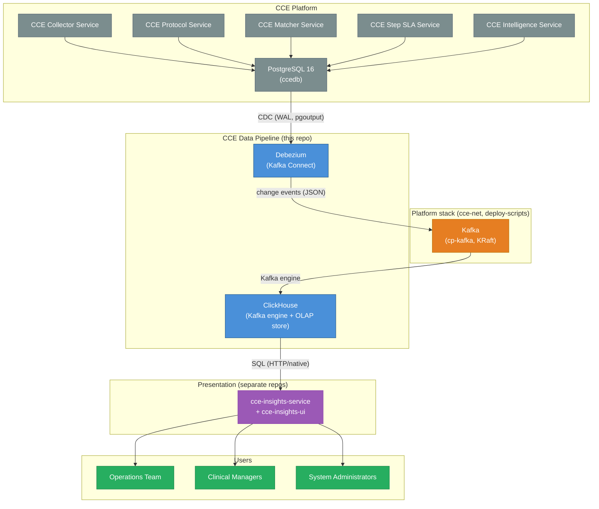
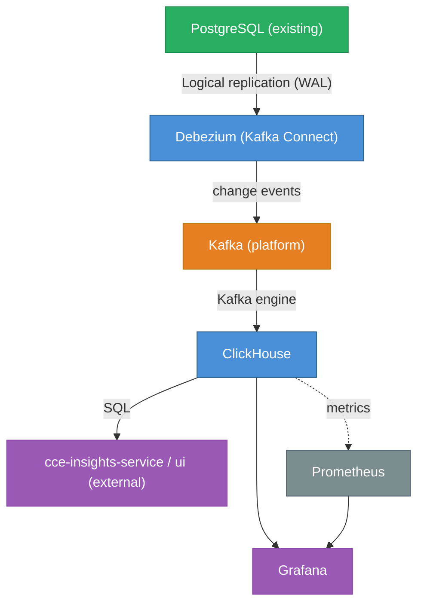

# CCE Data Pipeline — Architecture Overview

## 1. System Context

**This pipeline does NOT handle:** event ingestion, protocol matching, step completion, deviation detection, intelligence routing, dashboards/UI, or any write operations to CCE operational databases. The presentation layer (`cce-insights-service` / `cce-insights-ui`) is a separate deployment that reads ClickHouse.

---

## 2. Architecture Principles

| # | Principle | Rationale |
|---|-----------|-----------|
| 1 | **Open-source only** | No vendor lock-in; community support; cost-effective |
| 2 | **CDC-only (committed data)** | Analytics based solely on data committed to PostgreSQL — eliminates discrepancies from in-flight transactions that may be rolled back |
| 3 | **No custom stream processing** | ClickHouse MATERIALIZED columns + Materialized Views replace Flink — fewer moving parts, less operational burden |
| 4 | **Schema-on-read flexibility** | ClickHouse's JSON functions handle evolving FHIR payloads without migrations; `raw_payload` preserved for future extraction |
| 5 | **Immutable append-only** | All analytics data captured via CDC; ReplacingMergeTree handles updates idempotently |
| 6 | **Separation of pipeline & presentation** | This repo owns CDC → ClickHouse; `cce-insights-service`/`ui` own dashboards and query ClickHouse independently |
| 7 | **Graceful degradation** | Pipeline failures do not impact CCE operational services |

---

## 3. Technology Stack

### 3.1 Component Summary

| Layer | Technology | Version | License | Purpose |
|-------|-----------|---------|---------|---------|
| Change Data Capture | Debezium (on Kafka Connect) | `connect:3.0.0.Final` | Apache 2.0 | PostgreSQL source connector (pgoutput) → Kafka; ReselectColumns for TOAST |
| Event bus | Kafka (cp-kafka, KRaft) | 7.6.1 | Apache 2.0 | **Reused** from the platform deploy; CDC change-event topics `cce.public.*` |
| Analytics Database | ClickHouse | 26.3 LTS | Apache 2.0 | Consumes Kafka (Kafka engine) + columnar OLAP; serving layer for insights-service |
| Monitoring | Prometheus + Grafana | — | — | **Reused** from the platform deploy (provisioning artifacts in `infra/`) |

> **No stream processing layer.** ClickHouse MATERIALIZED columns handle field extraction at insert time. Materialized Views pre-aggregate. Zero custom application code in the pipeline.
>
> **Presentation is out of scope for this repo.** Dashboards and UI are served by `cce-insights-service` / `cce-insights-ui` (separate repos) querying ClickHouse directly.

### 3.2 Version Compatibility Matrix

| Component | Minimum Version | Tested Version | Notes |
|-----------|----------------|----------------|-------|
| Debezium | 2.4 (ReselectColumns) | 3.0.0.Final | On Kafka Connect; needs Kafka Connect 3.6+ for the offsets REST API |
| Kafka | 3.5 | 7.6.1 (cp-kafka, KRaft) | Reused from the platform deploy |
| ClickHouse | 24.3 | 26.3 LTS | 24.3+ for Refreshable Materialized Views (schema/07); 23.2+ for `clean_deleted_rows = 'Always'`; Kafka table engine built-in |
| PostgreSQL (source) | 14 | 16 | Existing CCE database (`ccedb`); `wal_level=logical`, REPLICA IDENTITY FULL |

### 3.3 Technology Decisions

#### Why ClickHouse?

| Alternative | Why Not |
|-------------|---------|
| TimescaleDB | PostgreSQL-based (same technology as source); row-store overhead for wide analytical queries |
| PostgreSQL (materialized views) | Adding query load to operational DB; limited compression; slower aggregations |
| Apache Druid | More complex to operate (ZooKeeper dependency) |
| Apache Pinot | More complex; limited community adoption |
| **ClickHouse** | ✅ Simple deployment; fastest analytical queries; excellent compression; SQL-compatible; MATERIALIZED columns; MVs with -State/-Merge combinators |

#### Why a separate presentation layer (cce-insights-service / cce-insights-ui)?

The existing CCE insights apps deliver bespoke clinical views — patient-detail pages,
service-workflow compliance timelines, source-comparison, pipeline-loss detection — that
are hand-built React components with no faithful equivalent in a generic BI tool (Superset,
Metabase, Grafana). Rather than approximate them, the insights apps are repointed at
ClickHouse as their data source. This repo owns only the pipeline (CDC → ClickHouse);
the apps own presentation and query ClickHouse via the `cce_pipeline` user.

#### Why Debezium + Kafka (not PeerDB)?

| Alternative | Why Not |
|-------------|--------|
| **PeerDB** | Point-to-point PG→ClickHouse; no multi-consumer fan-out; requires a 10-service stack + mandatory S3/MinIO staging; less natural fit once Kafka is already deployed |
| **ClickHouse MaterializedPostgreSQL** | Experimental; TOAST values not replicated; no schema control; DDL changes require full re-snapshot |
| **Debezium + Kafka** | ✅ Kafka is **already deployed** on the platform; future fan-out to other consumers (search, lake, ML) is a topic subscription; ClickHouse consumes Kafka directly (Kafka engine) → no sink connector, no S3 staging; durable replay buffer + DLQ |

**Why this choice:** Kafka already runs on the platform (`cce-net`), and the product roadmap anticipates other consumers of the change stream, which a Kafka topic serves naturally. ClickHouse's Kafka table engine ingests the topics directly, so the only added component is a Kafka Connect worker for Debezium.

**Trade-offs accepted with Debezium:**
- **Unchanged-TOAST placeholder** — Debezium emits `__debezium_unavailable_value` for large JSONB not changed in an UPDATE; mitigated by **ReselectColumns** (re-reads those values from the source by PK) + `REPLICA IDENTITY FULL`. Without it our MATERIALIZED extractions on `raw_payload` would corrupt on status-transition updates.
- **More moving parts** — Kafka Connect worker + connector config to operate (Kafka itself is shared/managed by the platform).
- **Envelope parsing in ClickHouse** — consumer MVs parse the Debezium JSON envelope and derive `_version` (`source.lsn`) / `_is_deleted` (`op='d'`).
- Table ORDER BY = PostgreSQL primary key (`id`) — mitigated by bloom-filter skip indexes (which work under `FINAL`).

---

## 4. Component Architecture

### 4.1 CDC Layer (Debezium → Kafka → ClickHouse)

A **Debezium PostgreSQL source connector** (on a Kafka Connect worker, `pgoutput` plugin) reads `ccedb`'s WAL and publishes JSON change events to Kafka topics `cce.public.<table>`. **ClickHouse ingests Kafka directly**: per source table there is a Kafka-engine "queue" table and a consumer MV (`schema/02-kafka-ingestion.sql`) that parses the Debezium envelope and inserts the flat row into the `ReplacingMergeTree(_version, _is_deleted)` base table (`schema/01`). There is **no ClickHouse sink connector and no S3 staging**.

All 15 CDC tables reside in the shared `ccedb` database (columns follow the CCE 2.0.0 schema — see `cce-common-util/docs/data-dictionary.md`). The connector excludes two large unused JSONB columns (`intelligence_event_log.event_payload`, `intelligence_delivery.fhir_payload`); `receiver_adaptor` + `destination_adaptor_mapping` **are** captured (they hold adaptor name/endpoint/routing, which is not denormalized onto `intelligence_delivery`). `facility` is CDC'd from the matcher service (no longer a static reference list), `step_sla_state_transition` is captured for the SLA thresholds it carries, and the two append-only `*_history` tables are captured for backfill. For the full table listing, connector config, and the envelope-parsing details, see [Data Flow & Schema Design](data-flow.md).

**CDC-metadata columns** (derived by the consumer MV from the Debezium envelope):
- `_version` — Debezium `source.lsn` (monotonic WAL position) → ReplacingMergeTree dedup version
- `_is_deleted` — `1` when `op='d'` (PostgreSQL DELETE); `clean_deleted_rows='Always'` purges these on merge

**TOAST handling:** the connector's **ReselectColumns** post-processor re-reads unchanged large JSONB (e.g. `raw_payload`) from the source by PK, so it never arrives as the `__debezium_unavailable_value` placeholder — keeping the MATERIALIZED extractions correct on status-transition UPDATEs.

### 4.2 Analytics Storage Layer (ClickHouse)

**Key features leveraged:**
- **Kafka table engine** — consumes the Debezium topics directly; consumer MVs parse the envelope into base tables (no sink connector)
- **ReplacingMergeTree(_version, _is_deleted)** — `clean_deleted_rows = 'Always'`: dedup by `_version` (`source.lsn`), physically removes deletes on merge
- **MATERIALIZED columns** — Extract JSON fields from `raw_payload` at insert time (zero query cost), defined inline in table DDL
- **Materialized Views** — 12 aggregation MVs (schema/03) — 10 insert-triggered on append-only sources, plus the two deviation-by-protocol/patient MVs as 30 s refreshable recomputes, since they must join `step_instances`; 5 refreshable daily-summary MVs (schema/07, `ReplacingMergeTree` backing — compliance in APPEND mode; the `event_time`/occurrence-keyed event, deviation, adoption, and referral MVs full-recompute over a 12-month rolling window); mutable entities served by the `argMaxState` current-state rollups or `FINAL`
- **AggregatingMergeTree** — incremental aggregation with `-State`/`-Merge` (append-only sources) and `argMaxState` current-state rollups (mutable entities)
- **SummingMergeTree** — Simple additive rollups (counts per hour/day)
- **Dictionaries** — Fast key-value lookups replacing JOINs (4 dictionaries; the `QUERY...FINAL` sources avoid duplicate rows from unmerged parts — `dict_patient_facility` instead dedups via `argMax` GROUP BY)
- **Bloom filter indexes** — 17 secondary indexes for fast point lookups on non-ORDER-BY columns (effective under `FINAL`)
- **TTL** — 90-day hot retention on 4 high-volume log tables
- **User profile** — `analytics` (readonly, `final=1`) is defined but NOT auto-assigned to the entrypoint-created `cce_pipeline`; analytics reads use explicit `FINAL` (or run `ALTER USER cce_pipeline SETTINGS PROFILE 'analytics'` to auto-apply)

For full schema DDL, MV catalog, Entity × Behavior coverage matrix, and query patterns, see [Data Flow & Schema Design](data-flow.md).

### 4.3 Presentation Layer (external — cce-insights-service / cce-insights-ui)

Dashboards and UI are **not** part of this repo. The `cce-insights-service` backend queries
ClickHouse (HTTP 8123 or native 9000, user `cce_pipeline`) and `cce-insights-ui` renders the
clinical views. Responsibilities that live in those apps:

- **ClickHouse access** — via the `cce_pipeline` read-only user; analytics reads use explicit `FINAL`
- **AuthN/AuthZ** — handled by the insights apps (e.g. Keycloak), not by this pipeline
- **Facility/role scoping** — enforced in the service layer
- **Bespoke clinical views** — patient detail, workflow timelines, source comparison, etc.

Per-domain query logic lives in the `cce-insights-service` repo; this repo provides the
ClickHouse schema (`schema/`) those queries target.

### 4.4 Operational Monitoring (Grafana + Prometheus)

The platform's **Grafana + Prometheus** (on `cce-net`) monitor pipeline health (this repo ships
provisioning artifacts in `infra/` to add there):
- Debezium connector state + lag (Kafka Connect metrics / `connectors/<name>/status`)
- ClickHouse insert rate, Kafka-engine consumer errors, query performance
- CDC freshness (age of latest event in ClickHouse) and PostgreSQL replication-slot lag

**Prometheus** scrapes ClickHouse (port 9363). Kafka Connect exposes JMX/Prometheus metrics for
Debezium; the Grafana alerts use the PostgreSQL replication-slot signal + ClickHouse freshness
(see `infra/grafana/provisioning/alerting/alerts.yaml`).

---

## 5. Integration Points

---

## 6. Data Domains

### Metric time semantics

> **Metric time semantics** — two clocks, chosen by metric type:
>
> - **Functional metrics** — clinical/business KPIs (adoption, compliance, deviations, event volume, referrals, patient cohorts). Measured on **clinical `event_time`**: when the clinical act actually happened, as carried on the inbound event. Date filters and daily rollups for these use `event_time`, so ingestion lag (offline sync, batch upload, retries, DLQ replay) never shifts the numbers.
> - **Technical / operational metrics** — pipeline health and ingestion throughput. Measured on **processing / system time** (`received_at` / `now()`): when the platform physically received or processed the data.
>
> Rule of thumb: "when did it happen clinically?" → `event_time`; "when did our system handle it?" → `received_at` / `now()`.

The daily-summary MVs in `schema/07` implement this: the `event_time`-derived MVs are keyed on `toDate(event_time)` with a 12-month rolling window (`now() - INTERVAL 12 MONTH`) and full-recompute refresh, and `scripts/validate-clickhouse.sh` enforces this contract.

| Domain | Key Metrics | Source → MV |
|--------|-------------|-------------|
| **Event Volume** | Events by resource type, facility, source, practitioner | `inbound_event_logs` → `mv_event_volume_hourly` (hourly buckets on `toStartOfHour(event_time)`); daily totals via `toDate(hour)` |
| **Facility Ranking** | Event volume, unique patients, unique practitioners per facility | `inbound_event_logs` → `mv_facility_summary` |
| **Practitioner Activity** | Events per practitioner, patient coverage, resource types | `inbound_event_logs` → `mv_practitioner_summary` |
| **Compliance** | Adherence rate, enrollment status, step metrics, deviation breakdown per protocol/day | `rollup_protocol_instance_current` + `rollup_step_current` (argMaxState, schema/06) → `mv_daily_compliance_kpis` (schema/07) |
| **Facility Activity / Ranking** | Active/inactive facility counts, active facility rate, facility ranking | Computed **live** in the insights service — active-facility tiles read `mv_event_volume_hourly` (event_time-keyed); ranking from the enrolled-patient cohort + `inbound_event_logs`. (`mv_daily_facility_kpis` / `mv_daily_facility_activity_summary` were **removed** — no live reader.) |
| **e-Buzima Adoption** | Actual vs expected patients per facility per day, adoption rate, reporting gap | `inbound_event_logs` (clinical footfall, `event_time`) + `facility` (CDC'd, schema/01) → `mv_daily_adoption_kpis` (schema/07) |
| **Referrals** | Received by HIE (accepted `TRANSFER_ENCOUNTER` events; dev/demo fallback = accepted event that completed a Referral step) + compliant (matched to a Referral step) / non-compliant split, total + per facility (+ district), per clinical day | `inbound_event_logs` (referral marker) with a `matcher_event_logs` ⋈ `step_instances` match subquery for the compliant count (`event_time`-keyed) → `mv_daily_referral_kpis` (schema/07) |
| **Deviations** | Overdue/missed counts, trends, by protocol/patient | `deviations` (⋈ `step_instances` for the enrolment) → `mv_deviation_trends`, `mv_deviation_by_protocol`, `mv_deviation_by_patient`; daily header cards via `mv_daily_deviation_kpis` (schema/07, keyed on clinical occurrence day — the breached threshold from `step_sla_state_transitions`) |
| **Ingestion Quality** | Acceptance rate, rejection reasons, source quality | `inbound_event_logs` → `mv_ingestion_quality` |
| **Intelligence & Triggers** | Trigger volume by action type, destination, reason | `intelligence_event_logs` → `mv_intelligence_summary`, `mv_intelligence_by_patient/protocol` |
| **Delivery Performance** | Success rate, latency, errors per adaptor/protocol | `intelligence_deliveries FINAL` (base table, ReplacingMergeTree) |
| **Steps & SLA** | `step_status` (completed?) × `sla_status` (on time?), protocol progress, SLA backlog | `step_instances FINAL` / `rollup_step_current`; `step_sla_state_transitions FINAL` for thresholds and processing lag |
| **State History (point-in-time)** | "As-of-date" enrollment status & step status pair — enables historical rebuild of the daily MVs | `protocol_instance_history` + `step_instance_history` (append-only CDC, schema/01) → `schema/09-historical-backfill.sql` |
| **Pipeline Health** | Connector state, CDC freshness, slot lag | Kafka Connect + ClickHouse metrics + Grafana |

> **Why the history tables exist:** `protocol_instance.status` and `step_instance.step_status` /
> `sla_status` are UPDATE-in-place — the prior value is overwritten, so the current-state rollups (schema/06)
> and the refreshable daily MVs (schema/07) can only ever snapshot *today*. The append-only
> `*_history` tables (written at the application layer by cce-common-util's `StateTransitionHistoryWriter` —
> Matcher for enrolment/creation/completion, Step SLA for each `sla_status`; Matcher `V1__initial_schema.sql`
> creates the tables) record every transition with its timestamp,
> making the daily MVs reconstructible for past
> dates after a full re-snapshot. They are inputs to **backfill only** — normal forward operation
> never reads them.

---

## 7. Capacity Planning

### 7.1 Event Volume Estimates

| Metric | Value | Notes |
|--------|-------|-------|
| Daily events (inbound) | 600,000 | Minimum requirement |
| Average event rate | ~7 events/second | Sustained |
| Peak event rate | ~50 events/second | 10-minute bursts |
| Average event size | ~2 KB | CloudEvents + FHIR payload |
| Daily data volume (raw) | ~1.2 GB | Before compression |
| Monthly data volume (raw) | ~36 GB | Before compression |
| ClickHouse compressed | ~3.6 GB/month | 10x columnar compression typical |
| Retention period | 2 years | Configurable |
| Total storage (2yr) | ~86 GB compressed | Well within single-node capacity |

### 7.2 Query Performance Targets

| Query Type | Target Latency | Example |
|------------|---------------|---------|
| Pre-aggregated dashboards | < 500ms | Compliance summary, event volume |
| Ad-hoc drill-downs | < 2s | Patient timeline, deviation details |
| Full-scan analytics | < 10s | Year-over-year comparisons |
| Export (CSV) | < 30s | Full compliance report |

### 7.3 Resource Requirements

#### Development / Staging

Only the components **this repo deploys** are listed (Kafka, Postgres, Prometheus/Grafana, and
the insights apps are provided by the platform stack).

| Component | Containers | CPU | RAM | Storage |
|-----------|-----------|-----|-----|---------|
| Kafka Connect (Debezium) | 1 | 1 core | 1 GB | — |
| ClickHouse | 1 | 4 cores | 16 GB | 100 GB SSD |
| **Total (this repo)** | **2** | **~5 cores** | **17 GB** | **100 GB** |

> Kafka, PostgreSQL, Prometheus/Grafana, and presentation (`cce-insights-service`/`ui`) are
> sized/deployed by the platform stack, not here.

#### Production (600k events/day)

| Component | Containers | CPU | RAM | Storage |
|-----------|-----------|-----|-----|---------|
| Kafka Connect (Debezium) | 1 | 2 cores | 2 GB | — |
| ClickHouse | 1 | 8 cores | 32 GB | 500 GB SSD |
| **Total (this repo)** | **2** | **~10 cores** | **34 GB** | **500 GB** |

> **Scale-out path:** ClickHouse supports sharding + replication for horizontal scaling. At 600k
> events/day, a single node is more than sufficient. Scale to a cluster when daily volume exceeds
> 10M events. Debezium throughput scales with `tasks.max` / Connect workers.

---

## 8. Security

| Concern | Mechanism |
|---------|-----------|
| **Network isolation** | Components on the shared `cce-net`; Kafka Connect REST + ClickHouse internal-only |
| **Authentication** | ClickHouse: native user/password (`cce_pipeline` read-only); Debezium uses the `cce_cdc_user` PG role; end-user auth handled by `cce-insights-service` (e.g. Keycloak) |
| **Authorization** | ClickHouse readonly profile for the serving user; facility/program/role scoping enforced in `cce-insights-service` |
| **Data in transit** | TLS for inter-component communication (ClickHouse TLS, Kafka TLS/SASL as configured on the platform) |
| **Data at rest** | ClickHouse disk encryption; sensitive fields accessible only to authorized roles |
| **Audit** | ClickHouse query log; Kafka Connect status/offsets; Kafka topic retention |
| **PII handling** | Patient UPIDs are pseudonymized identifiers (not names); FHIR resources stored for operational analytics only |

---

## 9. Failure Modes & Recovery

| Failure | Impact | Recovery |
|---------|--------|----------|
| ClickHouse down | Kafka-engine consumers stop; events buffer in Kafka topics (retention) | Restart ClickHouse; consumers resume from committed Kafka offsets |
| Debezium / Kafka Connect down | CDC stops; WAL grows on PostgreSQL | Connect restarts and resumes from the replication slot; `max_slot_wal_keep_size=10GB` caps WAL growth |
| Kafka down (platform) | No new change events; slot holds WAL | Resolve on the platform; Debezium + ClickHouse resume from offsets |
| insights-service/ui down | Dashboards unavailable (external app) | No pipeline/data impact; handled in that deployment |
| PostgreSQL replication slot dropped | Full re-snapshot required | `./scripts/resnapshot-mirror.sh` (reset offsets + drop slot + truncate + resume) |
| Full re-snapshot loses past daily-MV rows | The schema/07 refreshable MVs only resume from *today*; historical `snapshot_date` rows are gone | Run `schema/09-historical-backfill.sql` (manual, with a date range) to rebuild past days from `protocol_instance_history` + `step_instance_history` + append-only sources. The backfill joins the base `protocol_instances`/`step_instances` tables to recover `protocol_definition_id`/`protocol_instance_id` (no longer denormalized on the history rows), so hard-deleted instances are excluded. Coverage is limited to dates after application-level history capture began. |

**Key invariant:** The data pipeline is a **read-only observer**. Its failure never impacts CCE operational services.

> **Daily-MV reconstruction:** Without the `*_history` tables a re-snapshot permanently loses
> every past `snapshot_date` for the schema/07 MVs (they snapshot mutable current state and have
> no source for prior days). With them, `schema/09` rebuilds those days. Deploy the history
> triggers *before* any planned re-snapshot — they are not retroactive.

### Backup & Recovery

| Component | Strategy | RPO | RTO |
|-----------|----------|-----|-----|
| ClickHouse | Daily backup to object storage (`clickhouse-backup`) | 24 hours | 1 hour |
| Debezium/Kafka | Connect offsets + Kafka topic retention preserve replay; replication slot holds WAL position | 0 (resume from offset/slot) | 5 min |

### Upgrades

- **ClickHouse:** Rolling restart for minor versions; backup before major versions
- **Debezium/Connect:** bump the `quay.io/debezium/connect` tag; the connector resumes from its Kafka offset / replication slot automatically

---

## 10. Migration Strategy

| Phase | Duration | Activities |
|-------|----------|------------|
| **Phase 1: Foundation** | 2 weeks | Deploy ClickHouse + Kafka Connect; apply schema; register Debezium connector |
| **Phase 2: Materialized Views** | 1 week | Configure MVs for all analytics domains |
| **Phase 3: Insights repoint** | 2 weeks | Repoint `cce-insights-service` queries from the old backend to ClickHouse |
| **Phase 4: Validation** | 1 week | Run parallel with the existing backend; validate data accuracy |
| **Phase 5: Cutover** | 1 week | Switch `cce-insights-service` fully to ClickHouse; decommission the old insights backend |

**Total estimated timeline:** 7 weeks

---

## 11. Schema Evolution Strategy

The pipeline is designed for forward-compatible evolution without downtime:

| Change | Impact | Action Required |
|--------|--------|-----------------|
| New FHIR field needed in analytics | None (raw_payload preserved) | `ALTER TABLE ADD COLUMN ... MATERIALIZED` on `inbound_event_logs` |
| New FHIR resource type | Auto-captured (LowCardinality String) | Update `cce-insights-service` filters |
| PostgreSQL table gains a column | Debezium captures it in the envelope | `ALTER TABLE ADD COLUMN` on ClickHouse + extend the consumer MV in schema/02 |
| PostgreSQL table dropped/renamed | Connector errors on missing table | Update `table.include.list` in `connectors/debezium-postgres-source.json` |
| New PostgreSQL table needed | Add CDC capture | Add to `table.include.list` + base table (schema/01) + queue/consumer MV (schema/02) |
| A mutable status/state column must become point-in-time | UPDATE-in-place overwrites history | Add an append-only `*_history` table, written by the owning service at each transition in the same transaction as the change (pattern: the `*_history` tables in Matcher `V1__initial_schema.sql` + cce-common-util's `StateTransitionHistoryWriter`); CDC it like any table. Capture is forward-only — seed from current state to cover pre-existing rows. |

**Key invariant:** The `raw_payload` column in `inbound_event_logs` stores the full CloudEvent (including FHIR resource) as-is. Any new field extraction is a non-breaking addition — historical data can always be backfilled from `raw_payload` using ClickHouse's JSON functions.

> **Mutable lifecycle columns are the exception** to the backfill-from-source rule: event logs and
> dimensions are reconstructible from their own timestamps, but `protocol_instance.status` and
> `step_instance.step_status` / `sla_status` overwrite in place. Those are covered by the append-only history pattern
> above — the only two tables in the schema that require it.
