# CCE Data Pipeline — Data Flow & Schema Design

## 1. Architecture Overview

The CCE Data Pipeline uses a **CDC-only** architecture: committed PostgreSQL records flow via Debezium to Kafka, and ClickHouse consumes the Kafka topics directly (Kafka table engine). No custom stream processing.

```mermaid
flowchart LR
    subgraph Source
        PG["PostgreSQL 16<br/>Shared by all CCE services<br/>(ccedb)"]
    end

    subgraph CDC
        DBZ["Debezium<br/>(Kafka Connect)"]
        KAFKA["Kafka topics<br/>cce.public.*"]
    end

    subgraph Analytics
        Q["Kafka-engine<br/>queue tables"]
        CMV["Consumer MVs<br/>(parse envelope)"]
        CH["ClickHouse base tables<br/>ReplacingMergeTree(_version,_is_deleted)"]
        MV["Aggregation MVs / rollups"]
    end

    subgraph Presentation["Presentation (separate repos)"]
        SVC["cce-insights-service / cce-insights-ui"]
    end

    PG -->|"WAL (pgoutput)"| DBZ
    DBZ -->|"change events (JSON)"| KAFKA
    KAFKA --> Q
    Q --> CMV
    CMV -->|INSERT| CH
    CH -->|INSERT triggers| MV
    CH --> SVC
    MV --> SVC
```



> **ClickHouse consumes Kafka directly.** Per source table there is a Kafka-engine queue table
> and a consumer MV that parses the Debezium envelope (`op` / `after` / `source.lsn`) into the
> base table. No ClickHouse sink connector and no S3/MinIO staging. See [§2.3 Kafka Ingestion](#23-kafka-ingestion).

**Core principle:** Analytics should be purely on committed data in the database. This ensures:
- No discrepancies from in-flight events that may be rejected
- No data that bypasses validation/compliance checks
- Exact consistency with what the operational services store

---

## 2. CDC Pipeline

### 2.1 Debezium Source Connector (PostgreSQL → Kafka)

A Debezium PostgreSQL connector on Kafka Connect reads the WAL via logical replication (`pgoutput`) and publishes one JSON change-event topic per table (`cce.public.<table>`).

**Configuration** (see `connectors/debezium-postgres-source.json`):
- Replication slot: `cce_analytics_slot` · Publication: `cce_analytics_pub`
- Topic prefix: `cce` · Snapshot mode: `initial`
- Converters: JSON, schemas disabled (no Schema Registry)
- `tombstones.on.delete=false` (deletes carried as `op='d'`)
- **ReselectColumns** post-processor re-reads unchanged large JSONB (`inbound_event_log.raw_payload`, `protocol_definition.definition`, `action_definition.definition`, `intelligence_delivery.delivery_result`, `intelligence_event_log.evaluation_context`, `receiver_adaptor.definition`/`config`) from the source so they never arrive as the `__debezium_unavailable_value` placeholder
- Excluded columns: `intelligence_event_log.event_payload`, `intelligence_delivery.fhir_payload`

**Source Tables (all from shared `ccedb` database):**

| Table Owner | Source Table | ClickHouse Table |
|-------------|-------------|-----------------|
| Collector Service | `inbound_event_log` | `inbound_event_logs` |
| Compliance Service | `protocol_definition` | `protocol_definitions` |
| Compliance Service | `protocol_instance` | `protocol_instances` |
| Compliance Service | `step_instance` | `step_instances` |
| Compliance Service | `protocol_instance_history` | `protocol_instance_history` |
| Compliance Service | `step_instance_history` | `step_instance_history` |
| Compliance Service | `deviation` | `deviations` |
| Compliance Service | `intelligence_event_log` | `intelligence_event_logs` |
| Compliance Service | `action_definition` | `action_definitions` |
| Compliance Service | `compliance_event_log` | `compliance_event_logs` |
| Compliance Service | `facility` | `facility` |
| Intelligence Service | `intelligence_delivery` | `intelligence_deliveries` |
| Intelligence Service | `receiver_adaptor` | `receiver_adaptor` |
| Intelligence Service | `destination_adaptor_mapping` | `destination_adaptor_mapping` |

> **Note:** All CCE services share a single PostgreSQL database (`ccedb`). `REPLICA IDENTITY FULL` is set on all 14 tables so TOAST'd JSONB columns are fully replicated during UPDATEs. Column names/types are reconciled against the **live** `ccedb` schema.
>
> **Adaptor tables:** `receiver_adaptor` + `destination_adaptor_mapping` are captured (the adaptor name/endpoint/routing is **not** denormalized onto `intelligence_delivery`); resolve delivery → adaptor via `dict_delivery_adaptor` (schema/05).
>
> **`facility`** is now owned by the compliance service (`FacilityReferenceService`, Flyway `V3__facility.sql`) and CDC'd like any other table — it is **no longer** a static reference list loaded by SQL. schema/08 is now documentation-only; the table DDL lives in schema/01 and its Kafka consumer objects in schema/02.
>
> **History tables:** `protocol_instance_history` + `step_instance_history` are append-only transition logs (Flyway `V4__state_history.sql`, written by `StateTransitionHistoryService`). They are CDC'd forward but read **only** by the schema/09 backfill — normal forward operation never queries them (see [Architecture Overview § 6](architecture-overview.md#6-data-domains)).
>
> **Excluded columns:** two large unused JSONB columns are dropped at the connector — `intelligence_event_log.event_payload` and `intelligence_delivery.fhir_payload`.

### 2.2 Deduplication & Delete Handling

The 14 base tables are pre-created via `schema/01-create-tables.sql`; the consumer MVs
(`schema/02`) insert into them.

**Engine:** `ReplacingMergeTree(_version, _is_deleted)` with `SETTINGS clean_deleted_rows = 'Always', min_age_to_force_merge_seconds = 120` (ClickHouse 23.2+).

**Deduplication strategy:**
- `_version` = Debezium `source.lsn` (monotonic WAL position), derived per row by the consumer MV
- ReplacingMergeTree keeps the highest-`_version` row per ORDER BY key (`id`); a winning row with `_is_deleted=1` is physically removed during background merges
- **Queries use `FINAL`** (or the `argMaxState` rollups) when exact dedup is needed before merges complete
- `min_age_to_force_merge_seconds = 120` force-merges settled parts (~2 min after the last new part), so dedup/delete-purge actually happen promptly and `FINAL` reads stay cheap — the size-based merge scheduler alone may never collapse small parts

**Delete handling:**
- The consumer MV sets `_is_deleted=1` when the Debezium `op='d'` (it reads the `before` image for the key columns)
- `clean_deleted_rows = 'Always'` physically removes deleted rows on merge — no `WHERE _is_deleted = 0` filter needed for base-table `FINAL` reads (the `argMaxState` rollups do carry an explicit `is_deleted` guard)
- Reads must apply `FINAL` **explicitly** (or use the `argMaxState` rollups). The `cce_pipeline` user runs on the default profile; the `analytics` profile carries `final=1` but is not auto-assigned to the entrypoint-created user (see `infra/clickhouse/users.xml`). To auto-apply FINAL instead, run `ALTER USER cce_pipeline SETTINGS PROFILE 'analytics'`.

### 2.3 Kafka Ingestion

ClickHouse consumes the Debezium topics **directly** — no sink connector. For each source table
(`schema/02-kafka-ingestion.sql`):

1. **`<table>_queue`** — a Kafka-engine table reading `cce.public.<table>` as one raw JSON String
   per message (`kafka_format = 'JSONAsString'`).
2. **`<table>_mv`** — a consumer MV that parses the Debezium envelope and inserts the flat row
   into the base table:
   - `op = JSONExtractString(raw,'op')`; `payload = after` (or `before` for deletes)
   - `_version = source.lsn`; `_is_deleted = (op='d')`; `WHERE op IN ('c','u','r','d')`

Notes:
- **Temporal types:** verified on live `ccedb` — every timestamp column is `timestamptz`, so Debezium emits ISO-8601 strings and `parseDateTime64BestEffort*` is correct throughout (no micros-integer columns, so no `fromUnixTimestamp64Micro` needed).
- **JSONB** columns (`raw_payload`, `definition`, `delivery_result`) arrive as JSON strings and are stored as `String`; the `MATERIALIZED` columns then extract from them.
- **Broker** is not in the DDL: the queues use `ENGINE = Kafka(cce_kafka)`, a named collection
  (`infra/clickhouse/named-collections.xml`) whose broker is read from `KAFKA_BOOTSTRAP_SERVERS`
  via `from_env` — the same env var the Debezium worker uses, so it's set once in `.env`.

---

## 3. ClickHouse Schema Design

### 3.1 Table Categories

| Category | Tables | Engine | Purpose |
|----------|--------|--------|---------|
| Event logs | `inbound_event_logs`, `compliance_event_logs` | ReplacingMergeTree | Raw event audit trail |
| Domain entities | `protocol_instances`, `step_instances`, `deviations` | ReplacingMergeTree | Protocol lifecycle |
| State history | `protocol_instance_history`, `step_instance_history` | ReplacingMergeTree (append-only) | Point-in-time transition logs; backfill-only input (schema/09) |
| Intelligence | `intelligence_event_logs`, `intelligence_deliveries` | ReplacingMergeTree | Trigger & delivery audit |
| Reference data | `protocol_definitions`, `action_definitions`, `facility` | ReplacingMergeTree | Lookup/dimension tables (`facility` CDC'd from the compliance service) |
| Adaptor routing | `receiver_adaptor`, `destination_adaptor_mapping` | ReplacingMergeTree | Delivery adaptor name/endpoint/routing |

### 3.2 MATERIALIZED Columns (Field Extraction)

The `inbound_event_logs` table stores raw CloudEvents JSON in `raw_payload`. MATERIALIZED columns extract key fields **at insert time** — zero query cost, no separate processing.

`event_time` is **not** one of these — it is a stored CDC column (see 3.3) populated directly from the collector service's `inbound_event_log.event_time` (Postgres), which the `ClinicalEventTimeExtractor` derives from the FHIR resource's own clinical date field. It represents when the clinical event actually happened, as opposed to `received_at` (when the collector ingested it).

```sql
-- Extracted automatically when rows are inserted
subject          String MATERIALIZED JSONExtractString(raw_payload, 'subject'),
event_type       String MATERIALIZED JSONExtractString(raw_payload, 'type'),
resource_type    String MATERIALIZED
    JSONExtractString(JSONExtractRaw(raw_payload, 'data'), 'resourceType'),
patient_id       String ALIAS subject,
practitioner_ref String MATERIALIZED
    JSONExtractString(JSONExtractRaw(raw_payload, 'data'), 'practitionerRef'),
practitioner_display String MATERIALIZED
    JSONExtractString(JSONExtractRaw(raw_payload, 'data'), 'practitionerDisplay')
```

`facility_id` is also MATERIALIZED but is not a single `JSONExtractString` call — it re-derives the
facility from the raw FHIR resource directly rather than trusting the envelope, mirroring
compliance-service's `FacilityService` and openhim-cce-emitter-adaptor's `FacilityIdExtractor`:
`Encounter.hospitalization.origin` (the true reporting facility on a `TRANSFER_ENCOUNTER` — per FHIR
R4, `hospitalization` is only ever populated there) → `location[0].location` (the fallback for
non-transfer encounters, which never carry `hospitalization`) → the direct `location` Reference for
`Procedure`/`Immunization` → the envelope `facilityid` as a last resort. The `source-facility`
extension is deliberately never consulted. See the `facility_id` column in
`schema/01-create-tables.sql` for the full expression.

### 3.3 Table DDL Summary

#### `inbound_event_logs` (primary analytics table)

| Column | Type | Notes |
|--------|------|-------|
| `id` | UUID | Primary key |
| `cloudevents_id` | String | CloudEvents envelope ID |
| `source` | String | Event source system |
| `correlation_id` | String | Cross-service tracing |
| `raw_payload` | String | Full CloudEvents JSON |
| `status` | String | Processing status |
| `rejection_reason` | String | If rejected |
| `error_details` | String | Error detail (rejection drill-down) |
| `received_at` | DateTime64(6) | Ingestion timestamp |
| `updated_at` | DateTime64(6) | Last modification timestamp |
| `event_time` | Nullable(DateTime64(6)) | Clinical occurrence time, extracted from the FHIR resource by `ClinicalEventTimeExtractor` (collector service); null only if the collector's own fallback chain (FHIR date → envelope time → received_at) failed |
| `_version` | UInt64 | CDC version for ReplacingMergeTree deduplication |
| `_is_deleted` | UInt8 | Soft-delete flag (1 = deleted in PostgreSQL) |
| `subject` | String (MATERIALIZED) | Patient identifier |
| `event_type` | String (MATERIALIZED) | CloudEvents type |
| `facility_id` | String (MATERIALIZED) | Facility identifier |
| `resource_type` | String (MATERIALIZED) | FHIR resource type |
| `patient_id` | String (ALIAS) | Alias for subject |
| `practitioner_ref` | String (MATERIALIZED) | Practitioner reference |
| `practitioner_display` | String (MATERIALIZED) | Practitioner name |

**Engine:** `ReplacingMergeTree(_version, _is_deleted) SETTINGS clean_deleted_rows = 'Always'`  
**Partition:** `toYYYYMM(received_at)`  
**Order By:** `(id)`

#### `protocol_instances`

| Column | Type |
|--------|------|
| `id` | UUID |
| `patient_id` | String |
| `protocol_definition_id` | UUID |
| `protocol_canonical` | String |
| `status` | String |
| `enrolled_at` | DateTime64(6) |
| `updated_at` | DateTime64(6) |
| `expires_at` | Nullable(DateTime64(6)) |
| `_version` | UInt64 |
| `_is_deleted` | UInt8 |

**Engine:** `ReplacingMergeTree(_version, _is_deleted) SETTINGS clean_deleted_rows = 'Always'` | **Partition:** `toYYYYMM(enrolled_at)` | **Order By:** `(id)`

#### `step_instances`

| Column | Type |
|--------|------|
| `id` | UUID |
| `protocol_instance_id` | UUID |
| `action_id` | UUID |
| `state` | String |
| `completion_status` | String (EARLY / ON_TIME / LATE) |
| `repeat_index` | Int32 |
| `required_behavior` | String |
| `due_date` | Nullable(DateTime64(6)) |
| `overdue_date` | Nullable(DateTime64(6)) |
| `missed_date` | Nullable(DateTime64(6)) |
| `created_at` | DateTime64(6) |
| `updated_at` | DateTime64(6) |
| `completed_at` | Nullable(DateTime64(6)) |
| `_version` | UInt64 |
| `_is_deleted` | UInt8 |

**Engine:** `ReplacingMergeTree(_version, _is_deleted) SETTINGS clean_deleted_rows = 'Always'` | **Partition:** `toYYYYMM(created_at)` | **Order By:** `(id)`

#### `deviations`

| Column | Type |
|--------|------|
| `id` | UUID |
| `protocol_instance_id` | UUID |
| `step_instance_id` | UUID |
| `deviation_type` | LowCardinality(String) |
| `detected_at` | DateTime64(3) |
| `intelligence_event_id` | Nullable(UUID) |
| `metadata` | Nullable(String) |
| `updated_at` | DateTime64(3) |
| `_version` | UInt64 |
| `_is_deleted` | UInt8 |

**Engine:** `ReplacingMergeTree(_version, _is_deleted) SETTINGS clean_deleted_rows = 'Always'`  
**Partition:** `toYYYYMM(detected_at)`  
**Order By:** `(id)`

---

## 4. Materialized Views (Pre-Aggregation)

Materialized Views in ClickHouse are triggered on INSERT — they read from the source table and write pre-aggregated results to a target table.

### 4.1 Engine Selection

| Engine | Use Case | Columns Must Be |
|--------|----------|-----------------|
| `SummingMergeTree` | Simple additive counts | Summable (UInt64, Int64) |
| `AggregatingMergeTree` | Non-summable aggregates (uniq, quantile, any) | `-State` combinators |

**Rule:** If a view uses `uniq()`, `quantile()`, `any()`, or `avg()` → use `AggregatingMergeTree` with `-State`/`-Merge` combinators. If only `count()` → `SummingMergeTree` works.

### 4.2 MV Catalog

| MV | Source | Target Engine | Key Metrics |
|----|--------|---------------|-------------|
| `mv_event_volume_hourly` | `inbound_event_logs` | SummingMergeTree | `event_count` per hour/facility/source/type — hour = `toStartOfHour(event_time)` (clinical time, not `received_at`); daily totals derived via `toDate(hour)` at query time |
| `mv_facility_summary` | `inbound_event_logs` | AggregatingMergeTree | `uniqState(subject)`, `countState()` per facility/day |
| `mv_practitioner_summary` | `inbound_event_logs` | AggregatingMergeTree | `uniqState(subject)`, `countState()` per practitioner/day |
| `mv_deviation_trends` | `deviations` | SummingMergeTree | `deviation_count` per type/day |
| `mv_deviation_by_protocol` | `deviations` | SummingMergeTree | `deviation_count` per protocol_instance_id/type |
| `mv_deviation_by_patient` | `deviations` JOIN `protocol_instances` | AggregatingMergeTree | `countState()` per patient/deviation_type/day |
| `mv_ingestion_quality` | `inbound_event_logs` | SummingMergeTree | `event_count` per source/status/rejection_reason/day |
| `mv_compliance_processing_quality` | `compliance_event_logs` | SummingMergeTree | `event_count` per source/processing_status/day |
| `mv_intelligence_summary` | `intelligence_event_logs` | AggregatingMergeTree | `countState()`, `uniqState(subject)` per action_type/day |
| `mv_intelligence_by_patient` | `intelligence_event_logs` | AggregatingMergeTree | `countState()` per subject/action_type/day |
| `mv_intelligence_by_protocol` | `intelligence_event_logs` | AggregatingMergeTree | `countState()` per protocol_instance_id/action_type/day |
| `mv_patient_facility_latest` | `inbound_event_logs` | ReplacingMergeTree(last_seen) | Latest facility per patient (dictionary source) |
| `step_instances FINAL` | `step_instances` | ReplacingMergeTree | Current state per step; query with FINAL for exact counts |
| `intelligence_deliveries FINAL` | `intelligence_deliveries` | ReplacingMergeTree | Current state per delivery; query with FINAL for exact counts |

> **Compliance counts are not a SummingMergeTree/AggregatingMergeTree count MV.** A count MV over the mutable `protocol_instances`/`step_instances` would double-count CDC UPDATEs. Current-state counts come from the **`argMaxState` current-state rollups** (`rollup_protocol_instance_current`, `rollup_step_current` in schema/05 — always fresh, no FINAL) or from the base tables with `FINAL`.

### 4.3 Entity × Behavior Coverage Matrix

Every meaningful Entity × Behavior combination is pre-aggregated or resolvable via dictionary at query time.

| Behavior ↓ / Entity → | Patient | Facility | Practitioner | Protocol | Resource Type | Source |
|---|---|---|---|---|---|---|
| **Event Ingestion** | `mv_facility_summary` (uniq) | `mv_event_volume_hourly/daily` | `mv_practitioner_summary` | — | `mv_event_volume_hourly/daily` | `mv_event_volume_hourly/daily` |
| **Ingestion Quality** | — | — | — | — | — | `mv_ingestion_quality` |
| **Compliance** | `rollup_step_current` (argMaxState) | via `dict_patient_facility` | n/a | `rollup_protocol_instance_current` (argMaxState) | — | — |
| **Deviations** | `mv_deviation_by_patient` | via `dict_patient_facility` | n/a | `mv_deviation_by_protocol` | — | — |
| **Intelligence Triggers** | `mv_intelligence_by_patient` | via `dict_patient_facility` | n/a | `mv_intelligence_by_protocol` | — | — |
| **Delivery** | `intelligence_deliveries FINAL` | via `dict_patient_facility` | n/a | `intelligence_deliveries FINAL` | — | — |
| **Step States** | `step_instances FINAL` | via `dict_patient_facility` | n/a | `step_instances FINAL` | — | — |
| **Step Timeliness** | `step_instances FINAL` | via `dict_patient_facility` | n/a | `step_instances FINAL` | — | — |
| **Facility Summary** | `mv_facility_summary` (uniq) | `mv_facility_summary` | `mv_facility_summary` (uniq) | — | `mv_facility_summary` | — |
| **Practitioner Activity** | `mv_practitioner_summary` (uniq) | `mv_practitioner_summary` | `mv_practitioner_summary` | — | `mv_practitioner_summary` | — |

**Legend:**
- **n/a** — not applicable (practitioners don't own compliance/deviations/intelligence in the data model; they originate from inbound FHIR events only)
- **via `dict_patient_facility`** — resolve at query time with `dictGet('dict_patient_facility', 'facility_id', patient_id)`
- **—** — not a meaningful dimension for this behavior

### 4.4 Query Patterns

**SummingMergeTree queries** — use `sum()`:
```sql
SELECT
    hour,
    facility_id,
    sum(event_count) AS total_events
FROM mv_event_volume_hourly
WHERE hour >= now() - INTERVAL 24 HOUR
GROUP BY hour, facility_id
ORDER BY hour;
```

**AggregatingMergeTree queries** — use `-Merge` combinators:
```sql
SELECT
    facility_id,
    report_date,
    uniqMerge(unique_patients) AS unique_patients,
    countMerge(total_events) AS total_events
FROM mv_facility_summary
WHERE report_date >= today() - 7
GROUP BY facility_id, report_date
ORDER BY total_events DESC;
```

---

## 5. Indexes

### 5.1 Secondary Indexes

17 bloom filter indexes for fast point lookups on non-ORDER-BY columns. All indexes are materialized via `MATERIALIZE INDEX` to cover existing snapshot data. **Skip indexes prune granules even under `FINAL`**, so they remain effective for the analytics reads (which use `FINAL`).

| Table | Index | Column |
|-------|-------|--------|
| `inbound_event_logs` | `idx_cloudevents_id` | `cloudevents_id` |
| `inbound_event_logs` | `idx_correlation` | `correlation_id` |
| `inbound_event_logs` | `idx_source` | `source` |
| `inbound_event_logs` | `idx_subject` | `subject` (patient event history) |
| `inbound_event_logs` | `idx_facility` | `facility_id` (facility-scoped browse) |
| `protocol_instances` | `idx_patient_id` | `patient_id` |
| `protocol_instances` | `idx_protocol_definition` | `protocol_definition_id` |
| `step_instances` | `idx_protocol_instance` | `protocol_instance_id` |
| `step_instances` | `idx_state` | `state` |
| `step_instances` | `idx_action_id` | `action_id` |
| `deviations` | `idx_protocol_instance` | `protocol_instance_id` |
| `deviations` | `idx_step_instance` | `step_instance_id` |
| `intelligence_event_logs` | `idx_subject` | `subject` |
| `intelligence_event_logs` | `idx_protocol_instance` | `protocol_instance_id` |
| `intelligence_deliveries` | `idx_intelligence_event` | `intelligence_event_id` |
| `intelligence_deliveries` | `idx_status` | `status` |
| `intelligence_deliveries` | `idx_subject` | `subject` |

### 5.2 Why no projections

This pipeline uses **no projections**. ClickHouse skips projections whenever a query uses
`FINAL`, and analytics reads use `FINAL` explicitly — so projections would never
be used by `cce-insights-service`, while each `SELECT *` projection costs a full extra sorted
copy of the table (prohibitive on `inbound_event_logs`, which stores the large `raw_payload`
blob). The access patterns a projection would serve are instead covered by the skip indexes
above (which work under `FINAL`), and current-state compliance reads by the always-fresh
`argMaxState` rollups in `schema/06` (see [Deployment Guide § 6](deployment-guide.md#6-schema-deployment)).

> If you later run heavy **non-FINAL** analytical scans under a different profile, projections
> could help there — but they are intentionally omitted for the current `FINAL`-based access path.

---

## 6. Dictionary

### `dict_protocol_definitions`

ClickHouse dictionary for fast JOINs against protocol metadata. Uses `QUERY...FINAL` — reading via `TABLE` without FINAL can return duplicate rows from unmerged ReplacingMergeTree parts, corrupting dict lookups.

```sql
CREATE DICTIONARY dict_protocol_definitions (
    id UUID,
    name String,
    version String,
    url String,
    canonical String,
    status String
)
PRIMARY KEY id
SOURCE(CLICKHOUSE(
    QUERY 'SELECT id, name, version, url, concat(url, ''|'', version) AS canonical, status FROM cce_analytics.protocol_definitions FINAL'
    DB 'cce_analytics'
))
LIFETIME(MIN 60 MAX 300)
LAYOUT(HASHED());
```

Used with `dictGet()` for efficient protocol name lookups without JOIN. `canonical` is `url|version` to match `protocol_instances.protocol_canonical`.

### `dict_patient_facility`

Maps patient → most recent facility (refreshed every 5–10 min). Sources from `mv_patient_facility_latest` (a `ReplacingMergeTree(last_seen)` MV) using `argMax` to force deduplication at load time:

```sql
CREATE DICTIONARY dict_patient_facility (
    patient_id String,
    facility_id String,
    last_seen DateTime64(3)
)
PRIMARY KEY patient_id
SOURCE(CLICKHOUSE(
    QUERY 'SELECT patient_id, argMax(facility_id, last_seen) AS facility_id, max(last_seen) AS last_seen FROM cce_analytics.mv_patient_facility_latest GROUP BY patient_id'
    DB 'cce_analytics'
))
LIFETIME(MIN 300 MAX 600)
LAYOUT(COMPLEX_KEY_HASHED());
```

Enables facility-level slicing of patient-centric MVs at query time via `dictGet('dict_patient_facility', 'facility_id', patient_id)`.

### `dict_action_definitions`

Action definition metadata for enriching intelligence/delivery views. Uses `QUERY...FINAL` for same reason as `dict_protocol_definitions`.

```sql
CREATE DICTIONARY dict_action_definitions (
    id UUID,
    canonical_url String,
    name String DEFAULT '',
    action_type String,
    status String
)
PRIMARY KEY id
SOURCE(CLICKHOUSE(
    QUERY 'SELECT id, url AS canonical_url, name, kind AS action_type, status FROM cce_analytics.action_definitions FINAL'
    DB 'cce_analytics'
))
LIFETIME(MIN 60 MAX 300)
LAYOUT(HASHED());
```

### `dict_delivery_adaptor`

Resolves a delivery's `destination_adaptor_mapping_id` → adaptor name/endpoint/status by joining `destination_adaptor_mapping` to `receiver_adaptor` (the routing is **not** denormalized onto `intelligence_delivery`). Both sources read `FINAL` for the same dedup reason as above.

```sql
CREATE DICTIONARY dict_delivery_adaptor (
    destination_adaptor_mapping_id UUID,
    destination    String,
    adaptor_name   String,
    endpoint_url   String,
    adaptor_status String
)
PRIMARY KEY destination_adaptor_mapping_id
SOURCE(CLICKHOUSE(
    QUERY 'SELECT m.id AS destination_adaptor_mapping_id, m.destination, r.name AS adaptor_name, r.endpoint_url, r.status AS adaptor_status FROM cce_analytics.destination_adaptor_mapping AS m FINAL INNER JOIN cce_analytics.receiver_adaptor AS r FINAL ON m.receiver_adaptor_id = r.id'
    DB 'cce_analytics'
))
LIFETIME(MIN 300 MAX 600)
LAYOUT(HASHED());
```

---

## 7. Data Lineage

```mermaid
flowchart TD
    subgraph PostgreSQL
        IEL["inbound_event_log"]
        PI["protocol_instance"]
        SI["step_instance"]
        DEV["deviation"]
        IEG["intelligence_event_log"]
        ID["intelligence_delivery"]
        AD["action_definition"]
        PD["protocol_definition"]
        CEL["compliance_event_log"]
    end

    subgraph ClickHouse Tables
        CH_IEL["inbound_event_logs"]
        CH_PI["protocol_instances"]
        CH_SI["step_instances"]
        CH_DEV["deviations"]
        CH_IEG["intelligence_event_logs"]
        CH_ID["intelligence_deliveries"]
        CH_AD["action_definitions"]
        CH_PD["protocol_definitions"]
        CH_CEL["compliance_event_logs"]
    end

    subgraph Materialized Views
        MV1["mv_event_volume_hourly"]
        MV2["mv_facility_summary"]
        MV3["mv_practitioner_summary"]
        MV4["mv_deviation_trends"]
        MV5["mv_deviation_by_protocol"]
        MV6["mv_deviation_by_patient"]
        MV7["mv_ingestion_quality"]
        MV8["mv_compliance_processing_quality"]
        MV9["mv_intelligence_summary"]
        MV10["mv_intelligence_by_patient"]
        MV11["mv_intelligence_by_protocol"]
        MV12["mv_patient_facility_latest"]
    end

    subgraph Direct Queries (FINAL)
        BT0["protocol_instances FINAL"]
        BT1["step_instances FINAL"]
        BT2["intelligence_deliveries FINAL"]
    end

    IEL -->|CDC| CH_IEL
    PI -->|CDC| CH_PI
    SI -->|CDC| CH_SI
    DEV -->|CDC| CH_DEV
    IEG -->|CDC| CH_IEG
    ID -->|CDC| CH_ID
    AD -->|CDC| CH_AD
    PD -->|CDC| CH_PD
    CEL -->|CDC| CH_CEL

    CH_IEL --> MV1
    CH_IEL --> MV2
    CH_IEL --> MV3
    CH_IEL --> MV7
    CH_IEL --> MV12
    CH_DEV --> MV4
    CH_DEV --> MV5
    CH_DEV --> MV6
    CH_CEL --> MV8
    CH_IEG --> MV9
    CH_IEG --> MV10
    CH_IEG --> MV11
    CH_PI --> BT0
    CH_SI --> BT1
    CH_ID --> BT2
```

---

## 8. TTL & Data Lifecycle

| Table | TTL | Rationale |
|-------|-----|-----------|
| `inbound_event_logs` | 90 days | High-volume log; set in schema/03 |
| `intelligence_event_logs` | 90 days | High-volume trigger log; set in schema/03 |
| `intelligence_deliveries` | 90 days | High-volume delivery log; set in schema/03 |
| `compliance_event_logs` | 90 days | High-volume compliance log; set in schema/03 |
| `deviations` | (none) | Clinical compliance record — retained indefinitely |
| `protocol_instances` | (none) | Active patient data |
| `step_instances` | (none) | Active workflow data |

> Healthcare regulations (e.g., HIPAA) typically require 7-year retention. The 90-day TTL applies to the ClickHouse hot tier. Configure cold-tier archival to object storage with a separate 7-year TTL to meet compliance requirements.

Partitioning by `toYYYYMM()` on date columns enables efficient partition-level drops for aged data.

---

## 9. Query Examples

### Patient Timeline
```sql
SELECT
    event_time,
    event_type,
    resource_type,
    facility_id
FROM inbound_event_logs FINAL
WHERE patient_id = 'patient-uuid'
ORDER BY event_time DESC
LIMIT 100;
```

### Facility Dashboard (using MV)
```sql
SELECT
    facility_id,
    uniqMerge(unique_patients) AS patients,
    countMerge(total_events) AS events
FROM mv_facility_summary
WHERE report_date >= today() - 30
GROUP BY facility_id
ORDER BY events DESC
LIMIT 20;
```

### Compliance Overview
```sql
-- Query protocol_instances FINAL for live status counts. There is intentionally NO
-- count MV: countIfState(status='X') double-counts rows updated via CDC.
-- Faster + always-fresh alternative: the argMaxState rollups (rollup_protocol_instance_current
-- / rollup_step_current, schema/05) — no FINAL, no scan-and-dedup. See deployment-guide.md § Step 4.
SELECT
    pi.protocol_canonical,
    count()                                                                AS total,
    countIf(pi.status = 'COMPLETED')                                       AS completed,
    round(countIf(pi.status = 'COMPLETED') / nullIf(count(), 0) * 100, 1) AS pct
FROM protocol_instances pi FINAL
GROUP BY pi.protocol_canonical
ORDER BY total DESC;
```

### Deviation Trends
```sql
SELECT
    report_date,
    deviation_type,
    sum(deviation_count) AS count
FROM mv_deviation_trends
WHERE report_date >= today() - 90
GROUP BY report_date, deviation_type
ORDER BY report_date;
```
