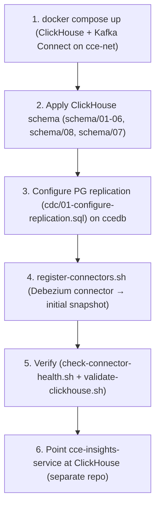

# CCE Data Pipeline — Deployment Guide

## Table of Contents

1. [Prerequisites](#1-prerequisites)
2. [Infrastructure Components](#2-infrastructure-components)
3. [Docker Compose (Development)](#3-docker-compose-development)
4. [Bootstrap Order](#4-bootstrap-order)
5. [Debezium Connector Setup](#5-debezium-connector-setup)
6. [Schema Deployment](#6-schema-deployment)
7. [Post-Deployment Validation](#7-post-deployment-validation)
8. [Monitoring & Observability](#8-monitoring--observability)
9. [Backfill & Replay](#9-backfill--replay)
10. [Rollback Procedures](#10-rollback-procedures)
11. [Operational Procedures](#11-operational-procedures)
12. [Troubleshooting](#12-troubleshooting)

---

## 1. Prerequisites

### Pre-deployment Checklist
These are **outcomes to confirm**, not separate manual steps — the scripts below produce them.
- [ ] Platform stack up on `cce-net` (Kafka, `ccedb`, Prometheus/Grafana) — or at least `docker network create cce-net`
- [ ] **`ccedb` is on the CCE 2.0.0 schema** — the Protocol, Matcher and Collector services have run their Flyway migrations (deploy order Protocol → Matcher → Step SLA), or a 1.x database was upgraded with `cce-matcher-service/migration/run-upgrade.sh`. `cdc/01` names 2.0.0 tables (`matcher_event_log`, `step_sla_state_transition`) and fails against a 1.x schema.
- [ ] **PostgreSQL source prepared** by `cdc/01-configure-replication.sql` and confirmed by `scripts/validate-cdc-config.sh` — i.e. `wal_level=logical`, role `cce_cdc_user`, `REPLICA IDENTITY FULL` on all 15 tables, and publication `cce_analytics_pub`
- [ ] PostgreSQL **restarted** if `wal_level` had to change (logical replication needs the restart)
- [ ] ClickHouse database `cce_analytics` + user `cce_pipeline` created (done by the container env on first boot)
- [ ] Kafka Connect reachable at `$CONNECT_URL`; broker reachable from Kafka Connect **and** ClickHouse
- [ ] Secrets provisioned (see below)
- [ ] Docker + Docker Compose v2 (or the components run directly on the server)

> The replication **slot** `cce_analytics_slot` is **not** created manually — Debezium auto-creates
> it on first connect. Only the *publication* must pre-exist (the connector sets
> `publication.autocreate.mode=disabled`), which `cdc/01` creates.

> **Moving from 1.x: rebuild ClickHouse, don't migrate it.** The 2.0.0 ClickHouse schema is not an
> in-place upgrade of the 1.x one — tables were renamed (`compliance_event_logs` → `matcher_event_logs`),
> columns replaced (`step_instances.state` → `step_status` + `sla_status`) and a table added
> (`step_sla_state_transitions`). Everything in `cce_analytics` is derived from `ccedb`, so drop the
> database, apply the schema below, and let Debezium take a fresh initial snapshot of the upgraded
> `ccedb`. The old connector's committed offsets and replication slot would otherwise make it resume
> streaming instead of snapshotting — reset them first (`scripts/resnapshot-mirror.sh` steps 1–2, or
> delete the connector and drop `cce_analytics_slot`). The 1.x Kafka topics
> (`cce.public.compliance_event_log`, and the old-shape messages on the others) have no reader in
> 2.0.0 and can be deleted.

### PostgreSQL Configuration

All source-side CDC setup is defined **once** in [`cdc/01-configure-replication.sql`](../cdc/01-configure-replication.sql) — the single source of truth. It sets `wal_level=logical`, the slot/WAL limits (`max_replication_slots`, `max_wal_senders`, `max_slot_wal_keep_size`), the `cce_cdc_user` role, `REPLICA IDENTITY FULL` on all 15 tables, and the `cce_analytics_pub` publication. Run it once as a privileged role, then verify:

```bash
psql -h "$POSTGRES_HOST" -U postgres -d "$POSTGRES_DATABASE" -f cdc/01-configure-replication.sql
./scripts/validate-cdc-config.sh "$POSTGRES_HOST" "$POSTGRES_PORT" postgres "$POSTGRES_DATABASE"
```

- If `wal_level` was not already `logical`, PostgreSQL must be **restarted** for it to take effect (the script changes the setting but cannot restart the server).
- Don't re-list the SQL here — edit `cdc/01-configure-replication.sql` so there's no second copy to drift.

### Secrets

| Secret | Purpose | Required By |
|--------|---------|-------------|
| `CLICKHOUSE_PASSWORD` | ClickHouse `cce_pipeline` user | clickhouse, cce-insights-service |
| `POSTGRES_READ_ONLY_PASSWORD` | PostgreSQL replication user (`cce_cdc_user`) | Debezium connector |


---

## 2. Infrastructure Components

### 2.1 ClickHouse

Single-node deployment with `ReplacingMergeTree(_version, _is_deleted)` tables (schema/01), populated by the Kafka-engine consumer MVs (schema/02).

- **Database:** `cce_analytics`
- **User:** `cce_pipeline`
- **Ports:** 8123 (HTTP), 9000 (Native), 9363 (Prometheus metrics)
- **Storage:** SSD recommended

For resource sizing (dev vs prod), see [Architecture Overview § 7.3](architecture-overview.md#73-resource-requirements).

### 2.2 Debezium on Kafka Connect

A single Kafka Connect worker (`quay.io/debezium/connect:3.0.0.Final`) runs the Debezium
PostgreSQL **source** connector. It joins the external `cce-net` network to reach the existing
Kafka broker and `ccedb`.

- **Connector:** `cce-ccedb-source` (config in `connectors/debezium-postgres-source.json`),
  registered via the Connect REST API (`:8083`)
- **Source:** `ccedb` via `pgoutput`, publication `cce_analytics_pub`, slot `cce_analytics_slot`
- **Topics:** `cce.public.<table>` (JSON, schemas disabled — no Schema Registry)
- **TOAST:** ReselectColumns post-processor (re-reads unchanged large JSONB from the source)
- **Sink:** none — ClickHouse consumes the topics with its Kafka table engine (schema/02)

> Kafka itself (`confluentinc/cp-kafka`, KRaft) is provided by the platform stack; this repo only
> adds the Connect worker.

### 2.3 Presentation layer (external)

Dashboards/UI are **not** deployed by this repo. `cce-insights-service` + `cce-insights-ui`
(separate repos) connect to ClickHouse and serve the clinical views:

- **ClickHouse connection:** host `clickhouse` (in-network) or the published host, HTTP `8123`
  / native `9000`, database `cce_analytics`, user `cce_pipeline` (read-only; analytics reads use explicit `FINAL`)
- **AuthN/AuthZ (incl. Keycloak):** handled by `cce-insights-service`
- **Query logic** lives in the `cce-insights-service` repo (targets the `schema/` defined here)

### 2.4 Prometheus + Grafana

```yaml
scrape_configs:
  - job_name: 'clickhouse'
    static_configs:
      - targets: ['clickhouse:9363']
```

---

## 3. Docker Compose (Development)

```bash
# Start all services
docker compose up -d

# Check health
docker compose ps

# View logs
docker compose logs -f kafka-connect
```

**Services started (this repo):** `clickhouse`, `kafka-connect`. Everything else (Kafka, `ccedb`,
Prometheus/Grafana, insights apps) is provided by the platform stack on `cce-net`.

**Volumes:** `clickhouse-data`

---

## 4. Bootstrap Order



> **The platform stack comes first.** Kafka, `ccedb`, Prometheus/Grafana, and the insights apps
> live in `openphc/deploy-scripts` on the external `cce-net` network — bring that up (or at least
> `docker network create cce-net`) before `docker compose up` here. Step 3 targets `ccedb`
> remotely (host/credentials from `.env`).

---

## 5. Debezium Connector Setup

The Debezium PostgreSQL source connector is registered on the Kafka Connect worker via its
REST API (`:8083`). `register-connectors.sh` interpolates `${POSTGRES_*}` from `.env` into
`connectors/debezium-postgres-source.json` and POSTs it. It is **not** run automatically by
`docker compose up`.

```bash
set -a; source .env; set +a   # POSTGRES_*, CONNECT_URL
./scripts/register-connectors.sh
```

This creates connector `cce-ccedb-source`: `snapshot.mode=initial`, publication `cce_analytics_pub`,
slot `cce_analytics_slot`, JSON converters, `tombstones.on.delete=false`, and the **ReselectColumns**
post-processor for TOAST. Debezium does the initial snapshot, then streams.

### Verify connector + ingestion

```bash
./scripts/check-connector-health.sh   # connector state + task states + ClickHouse rows + consumer errors
```

Per-topic detail: `${CONNECT_URL}/connectors/cce-ccedb-source/status` and **kafka-ui** (topics `cce.public.*`).

---

## 6. Schema Deployment

Apply all schema files in order (idempotent). With Debezium + Kafka, **base tables and the
Kafka-engine ingestion (schema/01–02) must exist before the connector starts** so the
consumer MVs are ready to land the snapshot.

```bash
CH_HOST=${CLICKHOUSE_HOST:-localhost}
CH_USER=${CLICKHOUSE_USER:-cce_pipeline}
CH_PASS=${CLICKHOUSE_PASSWORD:-cce_analytics_dev}
CH="clickhouse-client --host $CH_HOST --user $CH_USER --password $CH_PASS --database cce_analytics --multiquery"

$CH < schema/01-create-tables.sql          # 15 base tables — ReplacingMergeTree(_version, _is_deleted)
$CH < schema/02-kafka-ingestion.sql        # Kafka-engine queue + consumer MV per table (15 each; needs the broker reachable)
$CH < schema/03-create-materialized-views.sql
$CH < schema/04-create-indexes.sql
$CH < schema/05-create-dictionary.sql
$CH < schema/06-current-state-rollups.sql  # argMaxState current-state rollups (recommended)
$CH < schema/08-reference-tables.sql          # documentation-only: facility is now CDC'd (table in schema/01, consumer MV in schema/02) — no SQL executed
$CH < schema/07-daily-summary-aggregates.sql  # 5 refreshable daily-summary MVs: compliance, event, deviation, adoption, referral (CH 24.3+)
# NOTE: schema/09-historical-backfill.sql is intentionally NOT applied here. It is a manual,
#       parameterised (--param_from_date/--param_to_date) reconstruction of past daily-MV rows,
#       run ONLY after a full re-snapshot. See deploy-scripts docs/state-history-deployment.md (Step 6).
```

> **Why current-state rollups (schema/06), not projections/count-MVs/refreshable MVs?**
> Projections are skipped under `FINAL` (analytics reads use `FINAL`); count-based
> MVs on mutable tables double-count CDC UPDATEs; a refreshable MV would be stale.
> `AggregatingMergeTree + argMaxState(col, _version)` dedups by version on read via `argMaxMerge()`
> — incremental, correct, and live. Reports use a nested GROUP BY and filter `WHERE is_deleted = 0`.

> **Why APPEND-mode refreshable MVs (schema/07)?**
> Compliance status counts require current mutable state (not append-only inserts) — incremental
> MVs on mutable tables double-count CDC UPDATE events. `REFRESH EVERY 30 SECOND APPEND` inserts a
> new snapshot row every 30 seconds without deleting prior snapshots. The backing tables use
> `ReplacingMergeTree(refreshed_at)` with `(snapshot_date, <key>)` as ORDER BY — within the same
> calendar day, multiple refresh rows deduplicate to the latest via background merge (or FINAL at
> query time); across days all snapshots are preserved permanently, enabling date-range queries.
> The event, deviation, adoption, and referral MVs instead full-recompute a 12-month rolling window
> each cycle (keyed on clinical `event_time` / occurrence day), so backdated events land on the day
> they clinically occurred.
> Trigger an initial fill immediately after applying:
> ```sql
> SYSTEM REFRESH VIEW mv_daily_compliance_kpis_mv;
> SYSTEM REFRESH VIEW mv_daily_deviation_kpis_mv;
> SYSTEM REFRESH VIEW mv_daily_event_kpis_mv;
> SYSTEM REFRESH VIEW mv_daily_adoption_kpis_mv;
> SYSTEM REFRESH VIEW mv_daily_referral_kpis_mv;
> ```

Then register the Debezium connector (§5) to start the snapshot.

### Validate Schema
```bash
./scripts/validate-clickhouse.sh
```

---

## 7. Post-Deployment Validation

### Automated
```bash
./scripts/validate-clickhouse.sh
./scripts/data-quality-checks.sh
./tests/e2e/run-e2e-tests.sh
```

### Manual Checks

| Check | Command | Expected |
|-------|---------|----------|
| ClickHouse alive | `curl -s http://localhost:8123/ping` | `Ok.` |
| Tables exist | `clickhouse-client -q "SELECT count() FROM system.tables WHERE database='cce_analytics'"` | `>= 15` |
| MVs + consumer MVs exist | `clickhouse-client -q "SELECT count() FROM system.tables WHERE database='cce_analytics' AND engine='MaterializedView'"` | `>= 35` (12 aggregation + 15 consumer + 3 rollup + 5 daily-summary) |
| Kafka queues exist | `clickhouse-client -q "SELECT count() FROM system.tables WHERE database='cce_analytics' AND engine='Kafka'"` | `15` |
| Data flowing | `clickhouse-client -q "SELECT count() FROM cce_analytics.inbound_event_logs"` | `> 0` after snapshot |
| Debezium connector | `./scripts/check-connector-health.sh` | `HEALTHY` |
| Connector status | `curl -s $CONNECT_URL/connectors/cce-ccedb-source/status \| jq .connector.state` | `RUNNING` |

---

## 8. Monitoring & Observability

### Prometheus Metrics

| Metric | Source | Alert Threshold |
|--------|--------|-----------------|
| `clickhouse_insert_rows` | ClickHouse | Rate drop > 50% |
| `clickhouse_merge_tree_parts_count` | ClickHouse | `> 300` per table |
| `clickhouse_query_duration_ms` | ClickHouse | p99 > 5000ms |
| `pg_replication_slots_active` | PostgreSQL | `= 0` (slot inactive) |
| `pg_wal_lsn_diff_bytes` | PostgreSQL | `> 1 GB` |

### PostgreSQL WAL / Replication Slot Monitoring

Debezium uses a logical replication slot (`cce_analytics_slot`) in PostgreSQL. If the slot becomes inactive or WAL accumulates beyond safe limits, CDC will stall and disk may fill.

**Key queries:**

```sql
-- Check slot is active
SELECT slot_name, active, restart_lsn, confirmed_flush_lsn
FROM pg_replication_slots WHERE slot_name = 'cce_analytics_slot';

-- WAL lag in bytes
SELECT pg_wal_lsn_diff(pg_current_wal_lsn(), confirmed_flush_lsn) AS lag_bytes
FROM pg_replication_slots WHERE slot_name = 'cce_analytics_slot';
```

**Relevant setting** — `max_slot_wal_keep_size` caps how much WAL PostgreSQL retains for an inactive slot, so a stalled Debezium can't fill the disk unbounded. It's **already applied by `cdc/01-configure-replication.sql`** (don't set it separately here). If it's exceeded, PostgreSQL invalidates the slot — see Recovery below.

> **Recovery**: If the slot is inactive and WAL exceeds the limit, PostgreSQL will invalidate the slot. Debezium will fail to resume and requires a full re-snapshot (`./scripts/resnapshot-mirror.sh`). Monitor the `pg_wal_lsn_diff_bytes` metric and alert at 1 GB.

### Alerts

Configured in `infra/grafana/provisioning/alerting/alerts.yaml`:

| Alert | Condition | Severity |
|-------|-----------|----------|
| CDC Slot Inactive | `pg_replication_slots.active = false` for 2min | Critical |
| CDC Source Slot Inactive | `pg_replication_slots.active = false` for 1min | Critical |
| WAL Lag Excessive | `pg_wal_lsn_diff > 1 GB` for 5min | Warning |
| ClickHouse Insert Stall | Zero inserts for 5min | Warning |
| ClickHouse Disk Usage | > 80% | Warning |

### Alerting Contacts

Configure in Grafana → Alerting → Contact Points:
- **Slack**: `#cce-pipeline-alerts` channel webhook
- **PagerDuty**: Critical alerts (mirror stalled, disk full)
- **Email**: `cce-ops@organization.com`

---

## 9. Backfill & Replay

### Full Re-snapshot

If ClickHouse data is lost or needs a full refresh, use the re-snapshot helper:

```bash
set -a; source .env; set +a
./scripts/resnapshot-mirror.sh
```

It stops the connector, **resets its Kafka Connect offsets** (`DELETE /connectors/{name}/offsets`,
Connect 3.6+), drops the replication slot, truncates the ClickHouse tables (base + MV backing +
rollups), and resumes — yielding a fresh `snapshot.mode=initial` run. See
[Recreating / Backfilling an MV Safely](#recreating--backfilling-an-mv-safely).

### Partial Table Re-snapshot

Use Debezium's **ad-hoc (incremental) snapshot** signal to re-snapshot specific tables without a
full reset — configure a signaling table/topic and send a snapshot signal listing the tables
(see the Debezium signaling docs).

---

## 10. Rollback Procedures

### Debezium Connector Rollback
```bash
set -a; source .env; set +a

# Delete + re-register from the committed connector config
curl -s -X DELETE "$CONNECT_URL/connectors/cce-ccedb-source"
./scripts/register-connectors.sh
```

> Pause/resume without deleting: `PUT $CONNECT_URL/connectors/cce-ccedb-source/{pause,resume}`.

### ClickHouse Schema Rollback
```bash
# Non-destructive: ALTER TABLE for column additions
# Destructive: Restore from backup
clickhouse-client --host $CH_HOST --query \
  "RESTORE DATABASE cce_analytics FROM Disk('backups', 'latest/')"
```

### Full Rollback
```bash
docker compose down
git checkout LAST_GOOD_TAG
docker compose up -d
```

---

## 11. Operational Procedures

### ClickHouse Maintenance
```bash
# Check table sizes
clickhouse-client --query "
  SELECT table, formatReadableSize(sum(bytes_on_disk)) as size, sum(rows) as rows
  FROM system.parts
  WHERE database = 'cce_analytics' AND active
  GROUP BY table ORDER BY sum(bytes_on_disk) DESC"

# Optimize tables (merge parts)
clickhouse-client --query "OPTIMIZE TABLE cce_analytics.inbound_event_logs FINAL"

# Check merge health
clickhouse-client --query "
  SELECT table, count() as parts
  FROM system.parts WHERE database='cce_analytics' AND active
  GROUP BY table HAVING parts > 100 ORDER BY parts DESC"
```

### Debezium Connector Management
```bash
# Pause / resume the connector
curl -s -X PUT "$CONNECT_URL/connectors/cce-ccedb-source/pause"
curl -s -X PUT "$CONNECT_URL/connectors/cce-ccedb-source/resume"

# Restart the connector (and its tasks)
curl -s -X POST "$CONNECT_URL/connectors/cce-ccedb-source/restart?includeTasks=true"

# Restart the Connect worker
docker compose restart kafka-connect
```

### Materialized View Backfill

When a new MV is created, it only captures data inserted **after** creation. To populate with historical data:

```bash
# 1. Identify the target MV and its source table
clickhouse-client --query "SHOW CREATE TABLE cce_analytics.mv_deviation_trends"

# 2. Insert historical data using the MV's SELECT query against the source table
clickhouse-client --query "
  INSERT INTO cce_analytics.mv_deviation_trends
  SELECT
      toStartOfDay(detected_at) AS day,
      deviation_type,
      count() AS deviation_count
  FROM cce_analytics.deviations
  GROUP BY day, deviation_type"
```

**General pattern:**
```sql
-- INSERT INTO <mv_target_table> SELECT <mv_select_query> FROM <source_table>
-- Copy the SELECT from the MV definition and run as an INSERT INTO the MV's target table
INSERT INTO cce_analytics.<mv_target_table>
SELECT <columns_from_mv_definition>
FROM cce_analytics.<source_table>
WHERE <source_conditions>;
```

> **Note**: For `AggregatingMergeTree` MVs using `-State` functions, the backfill SELECT must use the same `-State` aggregate functions (e.g., `countState()`, `uniqState()`) — not their plain counterparts.

### Recreating / Backfilling an MV Safely

Each MV is **two objects** (see `schema/03-create-materialized-views.sql`):

| Object | Example | Role |
|--------|---------|------|
| Backing table | `mv_event_volume_hourly` | Stores the aggregated data; queried by dashboards |
| Trigger view (`_mv` suffix) | `mv_event_volume_hourly_mv` | Fires on INSERT, writes into the backing table via `TO` |

Because the trigger uses `TO <backing_table>` (not an implicit `.inner_id.<uuid>` table), the two can be managed independently.

**Fix a trigger's SELECT logic without losing data:**

```sql
-- Drops ONLY the trigger. The backing table and all accumulated aggregates survive.
DROP VIEW cce_analytics.mv_event_volume_hourly_mv;

-- Recreate with the corrected SELECT. New inserts resume flowing into the existing backing table.
CREATE MATERIALIZED VIEW cce_analytics.mv_event_volume_hourly_mv
TO cce_analytics.mv_event_volume_hourly
AS SELECT ... ;
```

> With the old implicit-inner-table pattern, `DROP VIEW` would have destroyed the inner table and all its data. The `TO` pattern makes trigger logic safely replaceable.

**⚠️ The backfill double-count race**

An MV trigger captures rows inserted **after** it is created. A backfill `INSERT INTO <backing_table> SELECT ... FROM <base_table>` reads **everything currently in the base table**. If CDC is actively inserting while you backfill, rows that arrived *after* trigger creation are counted **twice** — once by the live trigger, once by the backfill. With `SummingMergeTree`/`AggregatingMergeTree` this inflation is silent.

Safe procedures (pick one):

| Approach | Steps | Tradeoff |
|----------|-------|----------|
| **MV-before-data** | Apply all schema (including aggregation MVs) **before** registering the Debezium connector. The snapshot INSERTs then populate the MVs automatically — no backfill. (This is the documented bootstrap order.) | MV overhead (incl. `mv_deviation_by_patient` FINAL join) during the bulk snapshot load |
| **Quiet-window backfill** | 1. Pause the connector (`PUT .../pause`). 2. `TRUNCATE TABLE <backing_table>` if re-backfilling. 3. Run the backfill `INSERT`. 4. Resume (`PUT .../resume`). | Brief CDC lag while paused |

> When re-backfilling an existing backing table, `TRUNCATE TABLE cce_analytics.<backing_table>` first — otherwise the backfill adds to the data already accumulated by the live trigger, compounding the double-count.

### Scaling Guidance

| Component | Scaling Strategy |
|-----------|-----------------|
| ClickHouse | Add replicas (ReplicatedMergeTree), shard for > 1TB/day |
| Debezium | Tune snapshot `max.queue.size`/`max.batch.size`; dedicated Connect worker |
| Kafka Connect | Increase `tasks.max` / add Connect workers; tune `max.batch.size` |

---

## 12. Troubleshooting

### Connector Not Starting / FAILED
```bash
# Connector + task state and the failure trace
curl -s "$CONNECT_URL/connectors/cce-ccedb-source/status" | jq

# Kafka Connect worker logs
docker compose logs kafka-connect | grep -i error

# Common fixes:
# - PostgreSQL: wal_level=logical, slot + publication exist, REPLICA IDENTITY FULL
#   (./scripts/validate-cdc-config.sh <pg-host> <pg-port> <pg-user> ccedb)
# - Connectivity: Kafka Connect can reach ccedb (POSTGRES_HOST) and the kafka broker on cce-net
# - Re-register after fixing: ./scripts/register-connectors.sh
```

### Data Not Appearing in ClickHouse
```bash
# 1. Are events on the topics?  (kafka-ui → topics cce.public.*, or kafka-console-consumer)
# 2. Connector running?
curl -s "$CONNECT_URL/connectors/cce-ccedb-source/status" | jq .connector.state

# 3. Kafka-engine consumers erroring?  (broker unreachable from ClickHouse, parse errors)
clickhouse-client -q "SELECT database, table, last_exception FROM system.kafka_consumers WHERE database='cce_analytics' AND last_exception != ''"

# 4. Rows landed?
clickhouse-client -q "SELECT count() FROM cce_analytics.inbound_event_logs"
```

### Materialized Views Not Populating
```bash
# MVs trigger on INSERT to source table — check source table has data
clickhouse-client -q "SELECT count() FROM cce_analytics.inbound_event_logs"

# Check MV target table
clickhouse-client -q "SELECT count() FROM cce_analytics.mv_event_volume_hourly"

# If source has data but MV doesn't, the MV may have been created AFTER data was inserted
# Solution: recreate MV or backfill manually
```

### High ClickHouse Merge Pressure
```bash
# Check parts count
clickhouse-client -q "
  SELECT table, count() as parts, sum(rows) as total_rows
  FROM system.parts WHERE database='cce_analytics' AND active
  GROUP BY table ORDER BY parts DESC"

# Force optimize if needed
clickhouse-client -q "OPTIMIZE TABLE cce_analytics.inbound_event_logs FINAL"
```
